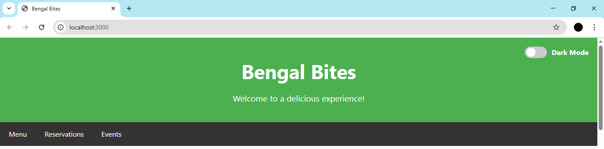
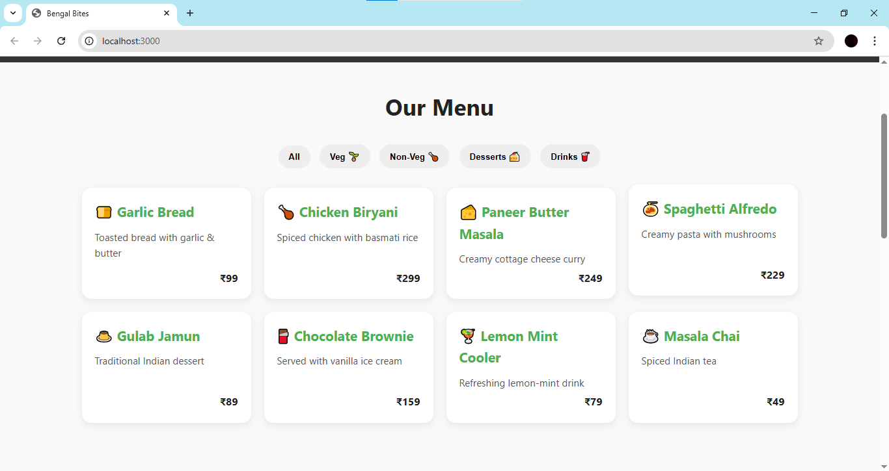
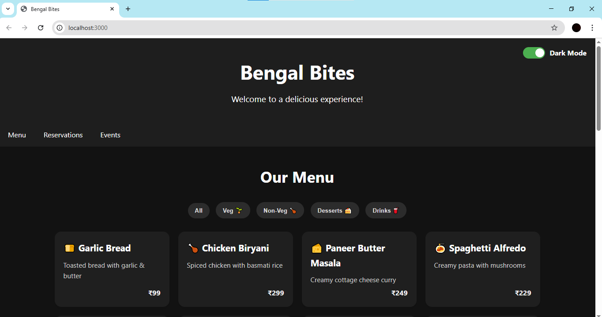
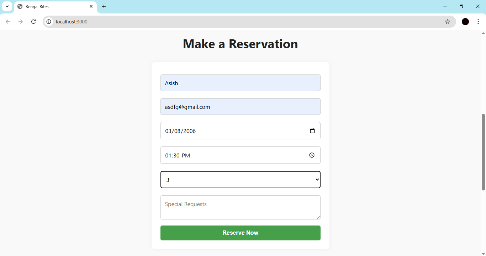
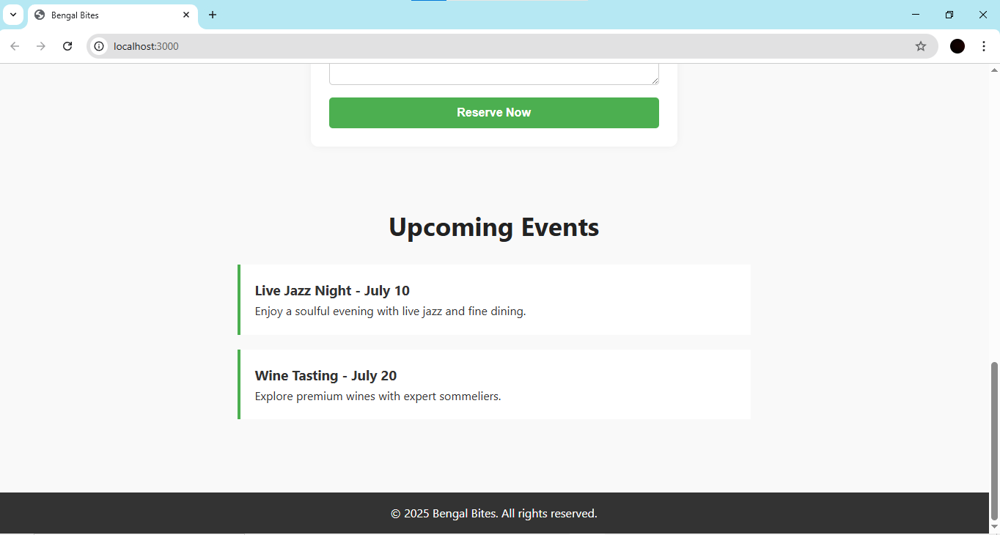

## 🍽️ Restaurant Website
A modern, responsive restaurant website designed using HTML, CSS, and JavaScript. This website showcases a restaurant’s menu, services, and contact information with clean visuals and smooth scrolling effects.


## 📌 Features
🌐 Fully responsive layout (mobile + desktop)

🧾 Menu section with categories

📷 Hero image with call-to-action

💬 Testimonials section

📞 Contact form (static)

🎨 Modern UI with animations and hover effects

🌙 Dark mode readability optimized


## 🛠️ Technologies Used
HTML5

CSS3

JavaScript (Vanilla)

Font Awesome (Icons)

Google Fonts

## 📂 Project Structure
```
Restaurant_Website/
│
├── public/
│   └── index.html       # Main HTML page
│   └── style.css        # Custom styling
│   └── script.js        # JavaScript functionality
├── package.json
├── package-lock.json
├── README.md            # Read me file
├── server.js            # backend
└── screenshots/         # screenshots 
```
## 🖼️ Screenshots
Place these images in the screenshots/ folder.

## Header Section



## Menu Section



## Dark Mode



## Reservation Section



## Event Section



## 🧑‍💻 How to Run This Project Locally
Clone the repository:
```
git clone https://github.com/Asish7980/Restaurant_Website.git
```
Navigate to the folder:
```
cd Restaurant_Website
```
### Open index.html in your browser:

You can simply double-click the index.html file.

### Or run a live server in VS Code:

Install the Live Server extension.

Right-click index.html → Open with Live Server.

## 📌 Notes
Headings and text colors are optimized for dark mode.

You can enhance this static project by connecting it to a backend or adding form handling.

## 📃 License
This project is licensed under the MIT License.

## by Asish Shaw
